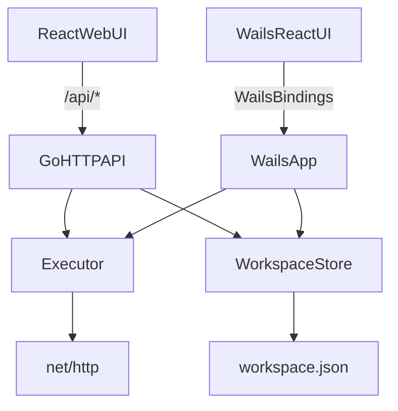

# Constrictor REST Client (Go + React) + Wails Desktop — Implementation Plan

## Non-negotiable constraint

- **Do not modify `constrictor-rest-client-ui/` at all.** It is reference-only.
- The real implemented frontend will be a **new React app inside** `constrictor-rest-client/`.

## Goals

- **Backend (Go)**: request execution + workspace persistence, designed with SOLID principles and clean interfaces.
- **Frontend (React)**: a new UI inside `constrictor-rest-client/` that mirrors the reference UI features.
- **Desktop (Wails)**: package the same Go + React into a desktop app.
- **Docs + handoff**: `DESIGN.md`, a detailed plan in `plans/`, a `PROGRESS.md` log updated after each step, and `agents.md` files in key backend folders.

## Current state

- `constrictor-rest-client-ui/` contains a working reference UI (requests, folders, headers/body, response viewer).
- `constrictor-rest-client/` currently has only `LICENSE` (backend not implemented yet).

## Architecture overview (beginner-friendly)

- There are 3 layers:
  - **Domain**: plain Go structs representing requests/workspaces.
  - **Services**: executor + storage logic behind interfaces.
  - **Transport**: HTTP API (for web UI) and Wails bindings (for desktop UI).

## Backend folder structure (SOLID)

All created under `constrictor-rest-client/`:

- `cmd/constrictor-rest-client/` — web server main (HTTP API)
- `internal/config/` — configuration
- `internal/domain/` — pure types + token sanitization utilities
- `internal/executor/` — `Executor` interface + `HTTPExecutor`
- `internal/storage/` — `WorkspaceStore` interface + file-backed store
- `internal/gdrive/` — Google Drive backup service with OAuth and file upload
- `internal/httpapi/` — handlers/router/DTO validation
- `wails/` — Wails entrypoint + bindings (desktop)
- `web/` — new React web UI (NOT the reference UI)
- `plans/` — plan files + `PROGRESS.md`

## API contract (for the new web UI)

- `GET /api/health` → `{ "ok": true }`
- `GET /api/workspace` → `{ "version": 1, "items": [...] }`
- `PUT /api/workspace` → saves the workspace
- `POST /api/execute` → executes a request and returns:
  - `status`, `headers`, `body`, `timeMs`, `sizeBytes`, plus an `error` object on failures
- `POST /api/gdrive/backup` → backs up workspace to Google Drive (with automatic token sanitization)
- `GET /api/gdrive/backups` → lists all workspace backups in Google Drive
- `POST /api/gdrive/restore` → restores a workspace from Google Drive

## Persistence

- Versioned JSON: `constrictor-rest-client/data/workspace.json` (gitignored)
- Env override: `CONSTRICTOR_DATA_PATH`

## Frontend plan (new React app inside constrictor-rest-client)

- Create `constrictor-rest-client/web/` as a Vite+React+TS app.
- Re-implement UI behavior by referencing `constrictor-rest-client-ui/` visually/functionally, but **without changing it**.
- Web UI talks to Go backend via `/api/*`.

## Wails plan (desktop)

- Create `constrictor-rest-client/wails/` Wails app.
- Reuse the same React UI code (either share from `web/` or have a Wails-frontend package) and call Go via Wails bindings.
- Keep HTTP API for web; Wails uses bindings for desktop.

## Documentation deliverables

- `constrictor-rest-client/DESIGN.md`:
  - architecture, package responsibilities, API contract, persistence schema, Wails notes
- `constrictor-rest-client/plans/`:
  - this plan saved as a detailed markdown
  - `PROGRESS.md` with a strict "append after each step" rule

## `agents.md` (requested)

- Add **simple `agents.md` files only inside `constrictor-rest-client/`** for **key folders we create**, e.g.:
  - `constrictor-rest-client/agents.md` (repo overview)
  - `cmd/constrictor-rest-client/agents.md`
  - `internal/domain/agents.md`
  - `internal/executor/agents.md`
  - `internal/storage/agents.md`
  - `internal/httpapi/agents.md`
  - `web/agents.md`
  - `wails/agents.md`
- Each `agents.md` will say:
  - purpose of the folder
  - key entrypoints/files
  - how to run/test that slice

## Step-by-step implementation (agent + amateur friendly)

1. **Scaffold Go module + SOLID folder layout**; add `cmd/constrictor-rest-client` with `/api/health`.
2. **Implement `WorkspaceStore`** + versioned JSON persistence + atomic writes.
3. **Implement `Executor`** + `HTTPExecutor` (timeouts, body-size cap, header handling, body modes).
4. **Build HTTP API**: `/api/workspace` and `/api/execute` with validation + error model.
5. **Create new React web UI** in `constrictor-rest-client/web/` mirroring the reference UI.
6. **Write `DESIGN.md`**, add `plans/PROGRESS.md`, save this plan into `plans/`.
7. **Add `agents.md`** to the key folders above.
8. **Add Wails desktop packaging** under `constrictor-rest-client/wails/`, reuse UI, bind Go services, document `wails dev` and `wails build`.
9. **Implement Google Drive backup** with automatic token sanitization for security:
   - Token sanitization utility to remove sensitive headers (Authorization, X-API-Key, etc.)
   - Google Drive service with OAuth authentication and file upload
   - Backend API endpoints for backup/restore operations
   - Frontend integration with OAuth flow and backup UI

## Progress logging rule

- After each completed step, append to `constrictor-rest-client/plans/PROGRESS.md`:
  - completed step, files changed, how to verify, what's next, blockers.
