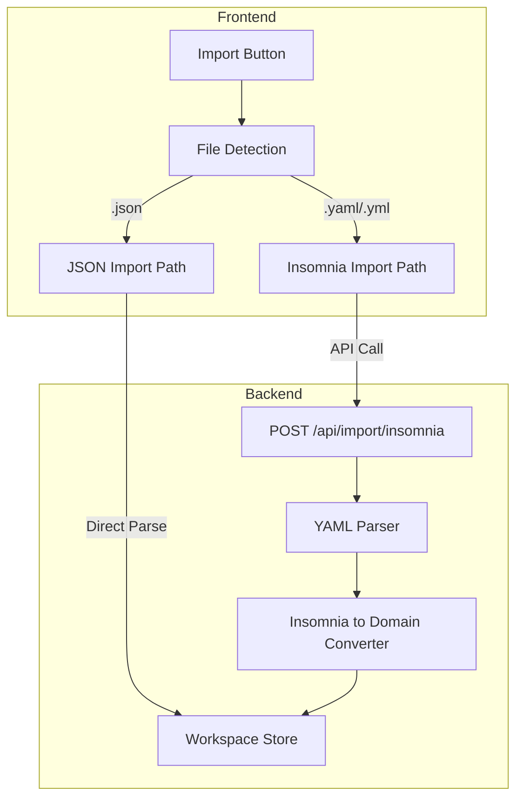

# Insomnia Import Feature Implementation

## Overview

Add support for importing Insomnia backup files (YAML format) into Constrictor REST Client. The implementation will include a Go backend parser/converter and frontend UI updates to detect and handle both native JSON and Insomnia YAML files.

## Architecture



## Insomnia Format Analysis

Based on [Insomnia-Backup-Feb-2026.yaml](Insomnia-Backup-Feb-2026.yaml):

- **Structure**: YAML with `type`, `schema_version`, `name`, `meta`, `collection`
- **Collection items**: Folders (with `children`) and Requests
- **Request fields**: `url`, `name`, `meta`, `method`, `body`, `headers`, `authentication`, `parameters`, `settings`
- **Body types**: `application/json`, `multipart/form-data`, `application/x-www-form-urlencoded`
- **Auth types**: `bearer`, `basic` (map to existing Constrictor auth types)
- **Additional sections**: `cookieJar`, `environments` (out of scope for initial implementation)

## Files to Create/Modify

### Backend (Go)

- **Create**: `internal/importer/insomnia/types.go` - Insomnia YAML type definitions
- **Create**: `internal/importer/insomnia/parser.go` - YAML parsing logic
- **Create**: `internal/importer/insomnia/converter.go` - Convert to domain types
- **Create**: `internal/importer/insomnia/parser_test.go` - Unit tests
- **Modify**: `internal/httpapi/router.go` - Add import endpoint
- **Modify**: `internal/httpapi/handlers.go` - Add import handler
- **Modify**: `go.mod` - Add `gopkg.in/yaml.v3` dependency

### Frontend (React)

- **Modify**: `web/src/App.tsx` - Detect file type and route to appropriate handler
- **Modify**: `web/src/components/Sidebar.tsx` - Accept `.yaml` and `.yml` files
- **Modify**: `web/src/wails.ts` - Add `ImportInsomnia` binding (if using Wails)

---

## Step 1: Define Insomnia Type Definitions

**Goal**: Create Go struct types that mirror the Insomnia YAML schema

**Files**:

- Create: `internal/importer/insomnia/types.go`

**Output**: Type-safe Go structs for parsing Insomnia YAML

**Detailed Tasks**:

1.1. Create the insomnia package directory structure

1.2. Define the root `InsomniaExport` struct with fields: `Type`, `SchemaVersion`, `Name`, `Meta`, `Collection`

1.3. Define `InsomniaItem` union type for folders and requests with fields:

- Common: `Name`, `Meta` (id, created, modified, sortKey, description)
- Folder: `Children []InsomniaItem`
- Request: `URL`, `Method`, `Body`, `Headers`, `Authentication`, `Parameters`, `Settings`

1.4. Define supporting types:

- `InsomniaBody`: `MimeType`, `Text`, `Params`
- `InsomniaHeader`: `Name`, `Value`, `Description`, `Disabled`
- `InsomniaAuth`: `Type`, `Token`, `Username`, `Password`, `Disabled`, `UseISO88591`, `Prefix`
- `InsomniaParam`: `Name`, `Value`, `Description`, `Disabled`

**Testing**:

- Types compile without errors
- Run `go build ./internal/importer/insomnia/...`

---

## Step 2: Implement YAML Parser

**Goal**: Parse Insomnia YAML content into Go structs

**Files**:

- Modify: `go.mod` - Add `gopkg.in/yaml.v3` dependency
- Create: `internal/importer/insomnia/parser.go`

**Output**: `Parse(content []byte) (*InsomniaExport, error)` function

**Detailed Tasks**:

2.1. Add YAML dependency: `go get gopkg.in/yaml.v3`

2.2. Implement `Parse` function that:

- Accepts raw YAML bytes
- Unmarshals into `InsomniaExport` struct
- Validates required fields (type, collection)
- Returns parsed struct or error

2.3. Add validation for schema version compatibility (schema_version: "5.1")

**Testing**:

- Unit test with sample YAML content
- Test error handling for invalid YAML

---

## Step 3: Implement Domain Converter

**Goal**: Convert Insomnia types to Constrictor domain types

**Files**:

- Create: `internal/importer/insomnia/converter.go`

**Output**: `Convert(*InsomniaExport) ([]domain.WorkspaceItem, error)` function

**Detailed Tasks**:

3.1. Implement `Convert` function that:

- Traverses `Collection` recursively
- Generates new UUIDs for each item
- Maintains parent-child relationships via `ParentID`
- Sets `CreatedAt` from meta.created (convert from milliseconds)

3.2. Implement `convertItem` helper for individual items:

- Detect folder vs request based on presence of `Children`
- For folders: convert recursively, set `Type: "folder"`
- For requests: convert all request fields, set `Type: "request"`

3.3. Implement body type mapping:

- `application/json` -> `json`
- `multipart/form-data` -> `form-data`
- `application/x-www-form-urlencoded` -> `url-encoded`
- Empty/missing -> `none`

3.4. Implement header conversion:

- Map `Name` -> `Key`, `Value` -> `Value`
- Map `Disabled: true` -> `Enabled: false`

3.5. Implement authentication mapping:

- `bearer` -> `AuthConfig{Type: "bearer", Config: {"token": ...}}`
- `basic` -> `AuthConfig{Type: "basic", Config: {"username": ..., "password": ...}}`
- Missing/none -> `AuthConfig{Type: "none"}`

3.6. Handle form data params (for `form-data` and `url-encoded` body types)

**Testing**:

- Unit tests with various request types
- Test nested folder structure conversion
- Test all body type mappings
- Test all auth type mappings

---

## Step 4: Create Unit Tests

**Goal**: Comprehensive test coverage for parser and converter

**Files**:

- Create: `internal/importer/insomnia/parser_test.go`
- Create: `internal/importer/insomnia/converter_test.go`

**Output**: Test suite with >80% coverage

**Detailed Tasks**:

4.1. Parser tests:

- `TestParse_ValidYAML` - Basic parsing success
- `TestParse_InvalidYAML` - Error handling
- `TestParse_MissingCollection` - Validation error
- `TestParse_NestedFolders` - Deep hierarchy

4.2. Converter tests:

- `TestConvert_BasicRequest` - Simple GET request
- `TestConvert_RequestWithBody` - POST with JSON body
- `TestConvert_RequestWithFormData` - multipart/form-data
- `TestConvert_RequestWithAuth` - Bearer and Basic auth
- `TestConvert_FolderHierarchy` - Nested folders with requests
- `TestConvert_HeaderMapping` - Enabled/disabled headers

4.3. Integration test with actual `Insomnia-Backup-Feb-2026.yaml` sample (first folder only)

**Testing**:

- `go test ./internal/importer/insomnia/... -v -cover`

---

## Step 5: Add HTTP API Endpoint

**Goal**: Create `/api/import/insomnia` endpoint for YAML file upload

**Files**:

- Modify: `internal/httpapi/router.go`
- Modify: `internal/httpapi/handlers.go`

**Output**: POST endpoint accepting multipart file upload

**Detailed Tasks**:

5.1. Add route in `router.go`:

```go
api.HandleFunc("/import/insomnia", handlers.HandleImportInsomnia).Methods("POST")
```

5.2. Implement `HandleImportInsomnia` handler:

- Parse multipart form with file upload
- Read file content
- Call insomnia parser and converter
- Option 1 (replace): Replace entire workspace items
- Option 2 (merge): Append to existing items (use query param `?mode=merge`)
- Save workspace via store
- Return success response with import summary

5.3. Add response types:

```go
type ImportResult struct {
    Status        string `json:"status"`
    FoldersCount  int    `json:"foldersCount"`
    RequestsCount int    `json:"requestsCount"`
}
```

5.4. Add error handling for:

- Invalid file type
- Parse errors
- Conversion errors

**Testing**:

- Manual test with curl:
  ```bash
  curl -X POST -F "file=@Insomnia-Backup-Feb-2026.yaml" http://localhost:8080/api/import/insomnia
  ```


---

## Step 6: Update Frontend Import Logic

**Goal**: Detect file type and route to appropriate import handler

**Files**:

- Modify: `web/src/components/Sidebar.tsx` - Accept `.yaml`, `.yml`, `.json`
- Modify: `web/src/App.tsx` - Add Insomnia import path

**Output**: Smart import that auto-detects file format

**Detailed Tasks**:

6.1. Update file input in `Sidebar.tsx`:

```tsx
<input type="file" accept=".json,.yaml,.yml" ... />
```

6.2. Update `handleImportWorkspace` in `App.tsx`:

- Check file extension
- For `.json`: Use existing JSON parse logic
- For `.yaml`/`.yml`: Call backend API `/api/import/insomnia`

6.3. Add API call function:

```tsx
const importInsomniaFile = async (file: File): Promise<SidebarItem[]> => {
  const formData = new FormData();
  formData.append('file', file);
  const response = await fetch('/api/import/insomnia', {
    method: 'POST',
    body: formData,
  });
  if (!response.ok) throw new Error('Import failed');
  const result = await response.json();
  return result.items;
};
```

6.4. Update UI feedback:

- Show loading state during import
- Show success message with counts (folders, requests)
- Show error message on failure

**Testing**:

- Test import with `.json` file (existing behavior)
- Test import with `.yaml` file (new Insomnia flow)
- Test error handling for invalid files

---

## Step 7: Documentation and Cleanup

**Goal**: Document the feature and ensure code quality

**Files**:

- Update: `README.md` or create `docs/import.md`
- Review all new code for cleanup

**Output**: Complete, documented feature

**Detailed Tasks**:

7.1. Add import documentation:

- Supported formats (Constrictor JSON, Insomnia YAML)
- Insomnia export instructions (how users get the YAML file)
- Limitations (environments, cookies not imported)

7.2. Code cleanup:

- Add Go doc comments to exported functions
- Review error messages for clarity
- Ensure consistent code style

7.3. Final testing:

- End-to-end test with real Insomnia backup
- Verify all request types import correctly
- Verify folder hierarchy preserved

**Testing**:

- Manual QA with complete workflow
- Import sample backup and verify in UI

---

## Out of Scope (Future Enhancements)

- **Environments**: Insomnia environments with variables (would require template substitution system)
- **Cookie Jar**: Cookie persistence across requests
- **Postman format**: Support for Postman collection JSON format
- **Export to Insomnia**: Reverse conversion for exporting

---

## Dependencies to Add

```
gopkg.in/yaml.v3 (for YAML parsing)
github.com/google/uuid (already available via indirect)
```

---

## Progress Tracking

A `PROGRESS_insomnia_import.md` file will be created alongside this plan to track step-by-step completion, following the guidelines in [plans/agents.md](plans/agents.md).
