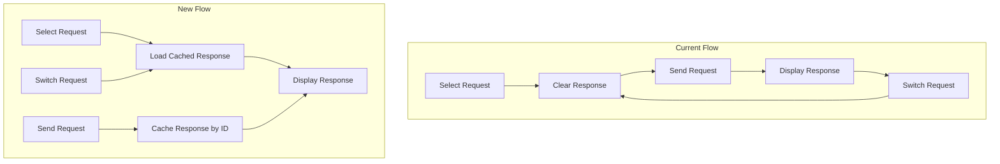

# Response Persistence and JSON Editor Enhancements

## Current State

- **Response state**: Single `ResponseData` stored in [`web/src/App.tsx`](web/src/App.tsx) - cleared when switching requests
- **Request body editor**: Plain `<textarea>` in [`web/src/components/RequestEditor.tsx`](web/src/components/RequestEditor.tsx) (lines 518-525)
- **Response display**: Has a `JsonNode` component in [`web/src/components/ResponseViewer.tsx`](web/src/components/ResponseViewer.tsx) with basic JSON tree view

## Architecture Overview



## Implementation Plan

### Step 1: Add Response Cache State in App.tsx

**Goal**: Store responses per request ID in a Map so they persist when switching.

**Files**:

- Modify: [`web/src/App.tsx`](web/src/App.tsx)

**Detailed Tasks**:

1.1. Add a `responseCache` state as `Map<string, ResponseData>`:

```typescript
const [responseCache, setResponseCache] = useState<Map<string, ResponseData>>(new Map());
```

1.2. Modify `handleSendRequest` to cache the response by request ID:

```typescript
setResponse(response);
setResponseCache(prev => new Map(prev).set(activeItem.id, response));
```

1.3. Create a derived `currentResponse` that looks up the cache when `activeId` changes:

```typescript
const currentResponse = activeId ? responseCache.get(activeId) ?? null : null;
```

1.4. Pass `currentResponse` instead of `response` to `ResponseViewer`.

**Testing**:

- Send a request, switch to another request, switch back - response should still display

---

### Step 2: Install Syntax Highlighting Dependencies

**Goal**: Add lightweight dependencies for JSON syntax highlighting in the body editor.

**Files**:

- Modify: [`web/package.json`](web/package.json)

**Detailed Tasks**:

2.1. Install `react-simple-code-editor` and `prismjs`:

```bash
cd web && npm install react-simple-code-editor prismjs
```

2.2. Install type definitions:

```bash
cd web && npm install -D @types/prismjs
```

**Output**: Dependencies installed

**Testing**:

- `npm install` completes without errors

---

### Step 3: Create JsonEditor Component with Syntax Highlighting

**Goal**: Replace the plain textarea with a syntax-highlighted JSON editor.

**Files**:

- Create: [`web/src/components/JsonEditor.tsx`](web/src/components/JsonEditor.tsx)

**Detailed Tasks**:

3.1. Create a new component using `react-simple-code-editor` with Prism highlighting:

```typescript
import Editor from 'react-simple-code-editor';
import { highlight, languages } from 'prismjs';
import 'prismjs/components/prism-json';
import 'prismjs/themes/prism-tomorrow.css';

interface JsonEditorProps {
  value: string;
  onChange: (value: string) => void;
  placeholder?: string;
}

const JsonEditor: React.FC<JsonEditorProps> = ({ value, onChange, placeholder }) => {
  return (
    <Editor
      value={value}
      onValueChange={onChange}
      highlight={code => highlight(code || '', languages.json, 'json')}
      placeholder={placeholder}
      // ... styling
    />
  );
};
```

3.2. Style to match existing dark theme (bg-[#1e1e20], text colors matching ResponseViewer's JsonNode)

**Testing**:

- JSON syntax should be colored (strings green, numbers blue, booleans yellow)

---

### Step 4: Add Prettify Button to JSON Body Editor

**Goal**: Add a button to format/prettify JSON in the body editor.

**Files**:

- Modify: [`web/src/components/RequestEditor.tsx`](web/src/components/RequestEditor.tsx)

**Detailed Tasks**:

4.1. Add a `handlePrettify` function:

```typescript
const handlePrettify = () => {
  try {
    const parsed = JSON.parse(normalizedRequest.body);
    onUpdate({ body: JSON.stringify(parsed, null, 2) });
  } catch (e) {
    // Invalid JSON - could show a toast/error
  }
};
```

4.2. Add a toolbar above the JSON editor with the "Prettify" button:

```tsx
{normalizedRequest.bodyType === 'json' && (
  <div className="flex flex-col flex-1">
    <div className="flex justify-end mb-2">
      <button
        onClick={handlePrettify}
        className="text-[11px] font-bold text-[#8ab4f8] hover:text-[#aecbfa] uppercase tracking-widest"
      >
        Prettify
      </button>
    </div>
    <JsonEditor
      value={normalizedRequest.body}
      onChange={(value) => onUpdate({ body: value })}
      placeholder='{ "message": "hello world" }'
    />
  </div>
)}
```

4.3. Replace the existing `<textarea>` (lines 518-525) with the new `JsonEditor` component

**Testing**:

- Paste minified JSON, click Prettify - should format with 2-space indentation
- Invalid JSON should not crash (button does nothing or shows error indicator)

---

### Step 5: Handle Edge Cases and Polish

**Goal**: Ensure robust behavior and good UX.

**Files**:

- Modify: [`web/src/App.tsx`](web/src/App.tsx)
- Modify: [`web/src/components/RequestEditor.tsx`](web/src/components/RequestEditor.tsx)
- Modify: [`web/src/components/JsonEditor.tsx`](web/src/components/JsonEditor.tsx)

**Detailed Tasks**:

5.1. Clear cached response when a request is deleted:

```typescript
// In handleDeleteItem
setResponseCache(prev => {
  const next = new Map(prev);
  next.delete(id);
  return next;
});
```

5.2. Add error indicator for invalid JSON (optional enhancement):

- Show a subtle red border or icon when JSON is invalid
- Could add a `useEffect` that validates on change

5.3. Ensure Prism CSS matches the dark theme:

- May need custom CSS overrides for `prism-tomorrow.css` to match the app's color palette

**Testing**:

- Delete a request - cached response should be removed
- Type invalid JSON - editor should indicate error (if implemented)
- Overall visual consistency with app theme

---

## Dependencies to Add

| Package | Purpose |

|---------|---------|

| `react-simple-code-editor` | Lightweight code editor with customizable highlighting |

| `prismjs` | Syntax highlighting engine |

| `@types/prismjs` | TypeScript definitions |

## Files Changed Summary

- [`web/src/App.tsx`](web/src/App.tsx) - Response cache state management
- [`web/src/components/RequestEditor.tsx`](web/src/components/RequestEditor.tsx) - Integrate JsonEditor, add Prettify button
- [`web/src/components/JsonEditor.tsx`](web/src/components/JsonEditor.tsx) - New component (create)
- [`web/package.json`](web/package.json) - Add dependencies
